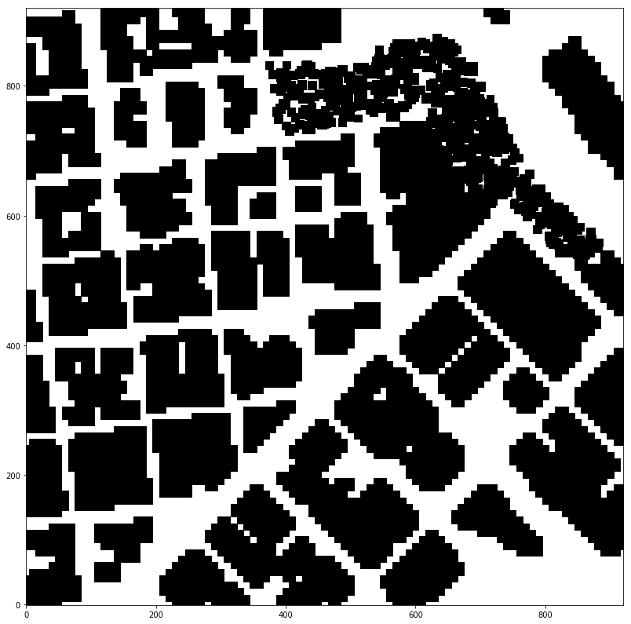

## Project: 3D Motion Planning

---

### Project Objective
In this project, using a given motion planner simulator (flight controller), I create an autopilot model which guides a drone from a given starting point to a goal point. The drone has to fly safely through given obstacles. Here are the steps:

1. Loading the 2.5D map in the colliders.csv file describing the environment.
2. Discretizing the environment into a grid or graph representation.
3. Defining the start and goal locations.
4. Performing a search using A* or other search algorithm.
5. Using a collinearity test or ray tracing method (like Bresenham) to remove unnecessary waypoints.
6. Returning waypoints in local ECEF coordinates (format for `self.all_waypoints` is [N, E, altitude, heading], where the drone’s start location corresponds to [0, 0, 0, 0].

### Model Overview
The model is implemented in two python files: motion_planning.py and planning_utils.py.  The MotionPlanning class extends the flight controller class (Drone), and therefore is the class which directly works with the Drone. It performs transitions between various states of the drone (Manual, Arming, Take off, Landing, Disarming). It also contains a function called ‘plan_path’ which is responsible for performing the steps described in Project Objective section with the help of auxiliary methods in planning_utils.py.

### Creating Grid of Obstacles
The drone needs to be precisely aware of the surrounding obstacles to fly safely.  The first step is to create a gird of obstacles, given the 2.5D provided in "colliders.csv" file.  The method 'create_grid' in planning_utils.py creates such a grid, in which coordinates are localized to the grid.

<table style="width:100%">
  <tr>
    <th>Grid of Obstacles</th>
  </tr>
  <tr>
    <td></td>
  </tr>
</table>

### Creating a Graph
The next step is to create a graph on the grid, in which edges represent safe and feasible lines the drone can take as parts of the path from start to goal. The graph is created via the following steps:

1. Creating a Voronoi Diagram on the Obstacle Grid: Using Vornoi, I partitioned the obstacle grid to regions, each containing one obstacle at its centre. Edges of these regions include points which are the furthest possible from the around obstacles.  As a result, the vertices of these regions are great candidates to be potentially the vertices of the graph I want to procure for my drone path.
2. Vertices gained using Vornoi in the last step are used to create a graph for the drone's path. I used Bresenham method to approximate straight lines between Voronoi vertices. Lines that are not off the map and do not collide with any obstacles are chosen for the final path graph.

The steps described above for graph creation are implemented in the create_graph method in planning_utils.py.

### Setting Start and Goal Points

I set the start point the home position of the drone on the gird, and randomly chose another point on the grid as the goal point. After converting them to the local coordinates, I used the closest_poing method define in the planing_utils.py to find the closest points in my graph to the specified start and goal points

### Path Searching

I used *__A-Star__* algorithm to find an optimal path through the graph, from start point (or more precisely from the closest vertex of the graph to the start point), to the goal. The implementation for A* is in planing_utils.py. 

A-Star is a type of breadth-first search algorithm which tries to find the smallest path from an initial node to a goal node in a graph. It basically constructs a graph from the initial node, and expands the tree (i.e. partial paths) one step at a time, until at least one of the partial paths meet the goal. At each iteration, A* needs to decide which partial path(s) to expand. It does that based on the estimated cost for each partial path to get to the goal. The cost estimation is done using a heuristic function.

A-Star returns a list of the waypoints the drone need to go through to get to the goal.

### Path Pruning 

Once the path (waypoints) returned by A*, I performed a collinearity check on waypoints of the path in order to remove the redundant waypoints.  In other words, for each straight line in the path, we don't need more than 2 points (one at the beginning and one at the end of the line), therefore the waypoints in between get removed. Path pruning effectively reduces the number of stops and transitions the drone has to make passing through waypoints. Please see *prune_path* and *collinearity_check* in *planning_utils.py*.

